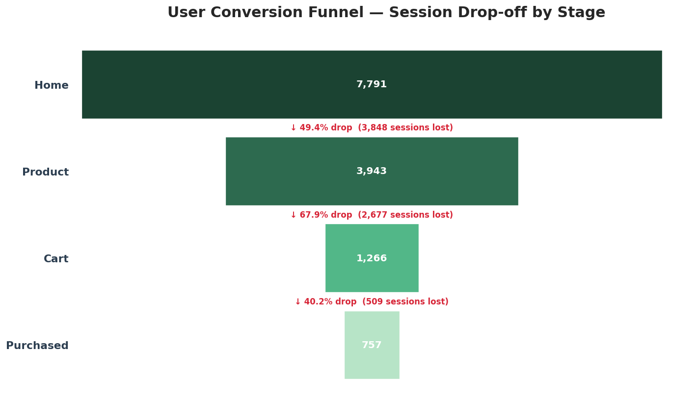
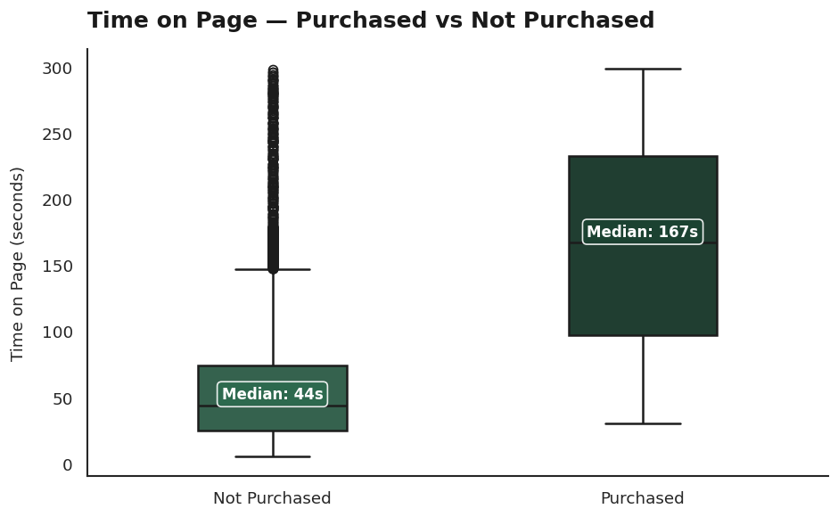
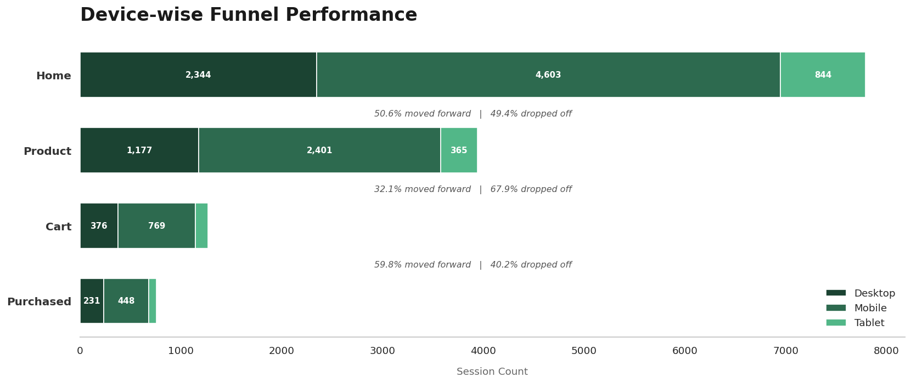
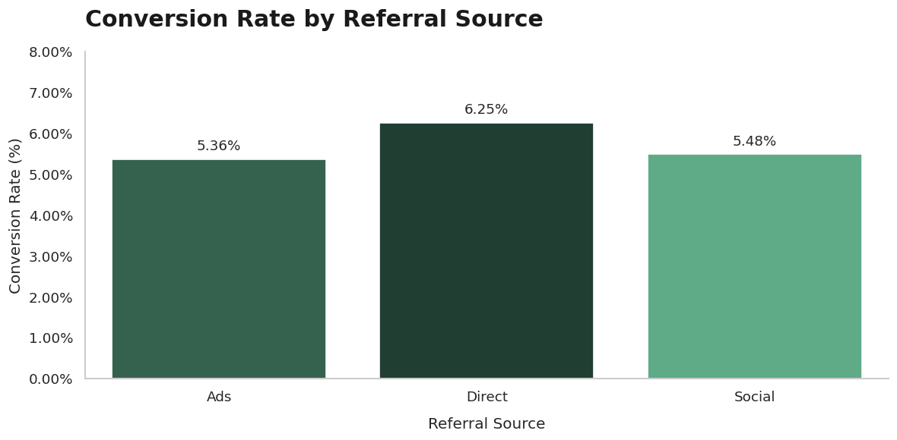
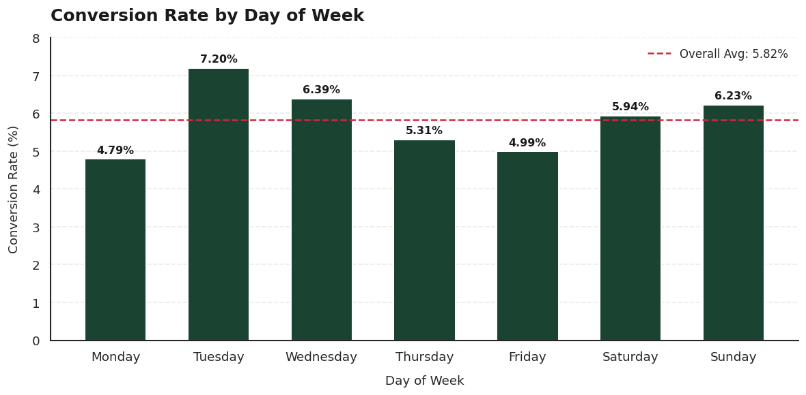
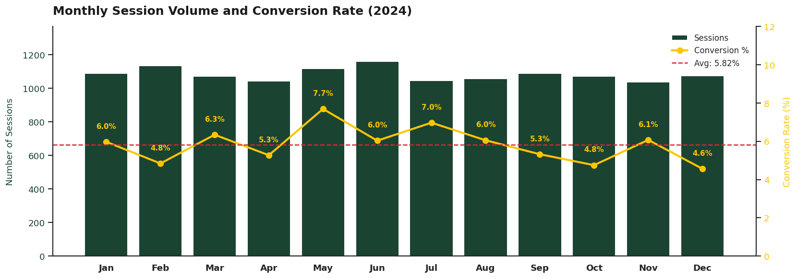

# <div align="center">User Behavior & Conversion Analysis</div>
<div align="center"><b>Python | Pandas | Matplotlib | Seaborn | SciPy</b></div>
<br>
<div align="center">Mapping the user journey from engagement to abandonment 
to identify and bridge the conversion gap.</div>
<br>
<div align="center"> 
  


<br>

[](https://google.com)


</div>
  
---

## The Short Version

13,000 sessions. 900 users. Only 757 purchases. That is a 5.82% conversion rate.

The other 12,243 sessions left without buying — and the majority of that 
loss happens at one critical step: **Product Page → Cart**, where 67.9% 
of users drop off.

This analysis identifies where the funnel breaks, tests which factors 
drive conversion using statistical methods, rules out three common 
assumptions, and points to the changes that will have the highest 
business impact.

---

## The Core Problem

**2,677 sessions reached the Product page and never added an item to cart.**

That is the single largest drop in the funnel. Users are landing on 
product pages, engaging with the content, and still leaving without 
taking action.

The problem is not checkout. It is not device type. It is not where 
traffic comes from. It is the **Product Page failing to convert 
interest into cart activity.**


---

## What the Numbers Show

| Funnel Stage | Sessions | Drop to Next Stage | What It Means |
|---|---|---|---|
| Home | 7,791 | 49.4% | High volume — but half never explore a product |
| Product | 3,943 | **67.9%** | **The main problem — 7 in 10 leave without adding to cart** |
| Cart | 1,266 | 40.2% | Moderate drop — room for improvement |
| Purchased | 757 | — | Final conversions |

Once a user reaches Cart, nearly 60% complete the purchase — the strongest transition in the funnel. The real battle 
is earlier — getting users to add items to cart, because the more they add, the higher the chance they buy.

---

## What Was Tested — And What Was Ruled Out

Four factors were tested using statistical methods before 
pointing at the product page.

| Factor | Test Used | Result |
|---|---|---|
| Device type | Chi-Square | **No difference** — p = 0.936. All devices convert identically |
| Referral source | Chi-Square | **No difference** — p = 0.124. No channel significantly outperforms |
| Time on page | Mann-Whitney U | **Significant** — purchasers spend 3.8x more time (p ≈ 0.000) |
| Items in cart | Observed pattern | **Strong signal** — cart size directly predicts conversion probability |

Three factors ruled out with statistical confidence. 
Two behavioral signals confirmed as key conversion drivers.

---

## Key Findings

### The Product Page is not converting engagement into action
Users who purchase spend a median of 167 seconds on page — 
compared to 44 seconds for non-purchasers. The challenge is 
not getting attention. It is converting that attention into 
cart activity.



### Cart size is the strongest predictor of conversion
- 0 items → 0.0% conversion (no exceptions)
- 1 item  → 9.9%
- 2 items → 19.3%
- 4 items → 50.5%

Every additional item added to cart significantly increases 
purchase probability.


### Device Type is Not the Problem
All devices show near-identical conversion rates and funnel 
drop-off patterns — confirmed statistically (p = 0.936).



### Referral Source is Significant
No channel significantly outperforms another (p = 0.124). 
Direct traffic leads marginally at 6.25%, but the difference 
is not statistically meaningful.



### Mid-week and summer months convert best
Tuesday (7.20%) and Wednesday (6.39%) are the strongest days. 
May (7.69%) and July (6.97%) peak across the year, while 
October–December dip below average.




---

## Assumptions vs Reality

| Assumption | Expected | Reality |
|---|---|---|
| Biggest drop at Product → Cart | ✅ True | 67.9% drop — confirmed as the main bottleneck |
| Mobile users convert less than Desktop | ❌ False | All devices within 0.2% of each other (p = 0.936) |
| More time on page → more likely to buy | ✅ True | Purchasers spend 3.8x more time (p ≈ 0.000) |
| Ads convert better than other channels | ❌ False | Direct leads at 6.25%, Ads lowest at 5.36% (p = 0.124) |
| More items in cart → higher conversion | ✅ True | Progressive — 0% to 50.5% across cart sizes |

---

## Recommendations

| Priority | Action | Impact |
|---|---|---|
| 🔴 High | Improve Product Page → Cart experience — prominent CTA, better images, trust signals | High |
| 🟠 High | Increase cart size — bundle deals, "Frequently Bought Together", multi-item incentives | High |
| 🟡 Medium | Re-engage cart abandoners — retargeting campaigns, cart reminders, time-limited offers | High |
| 🟢 Medium | Optimise campaign timing — mid-week focus, winter promotions Oct–Dec | Medium |
| 🔵 Low | Channel and device optimisation — not a priority, no significant difference found | Low |

---

## Dataset

| Detail | Info |
|---|---|
| **Source** | Synthetically generated for analytical purposes |
| **Total Sessions** | 13,000 |
| **Unique Users** | 900 |
| **Columns** | 9 |
| **Time Period** | January 2024 – December 2024 |
| **Type** | Synthetic |

⚠️ Note: This dataset is synthetically generated for analytical purposes. Each row represents a single page-level session visit — funnel stages are approximated using session distribution, not a sequential user journey. 
Absolute values and conversion rates may not mirror real-world platform performance. Insights should be validated against real data before implementation.

---

## Tools Used

| Tool | Used For |
|---|---|
| Python | Data cleaning, analysis, funnel calculations |
| Pandas | Session-level data operations and aggregations |
| NumPy | Numerical computations |
| Matplotlib | Funnel charts, trend charts, dual-axis visuals |
| Seaborn | Heatmaps, boxplots, distribution plots |
| SciPy | Chi-Square and Mann-Whitney U statistical tests |
| Google Colab | End-to-end analysis in one place |

---

## Project Structure
```
user-behavior-conversion-analysis/
│
├── 📓 user_behavior_conversion_analysis.ipynb
├── 📊 ecommerce_funnel_dataset.csv
├── 📄 README.md
│
└── 📁 images/
    ├── funnel_dropoff.png
    ├── device_funnel.png
    ├── referral_conversion.png
    ├── time_on_page.png
    ├── cart_conversion.png
    ├── monthly_trend.png
    └── weekly_trend.png
```

---
## How to Run

1. **Clone this repo**
```bash
git clone https://github.com/AnshMathur-1905/user-behavior-conversion-analysis.git
```

2. **Install required libraries**
```bash
pip install pandas numpy matplotlib seaborn scipy
```
3. **Open the notebook**

   **Option A — Jupyter:**
```bash
   jupyter notebook user_behavior_conversion_analysis.ipynb
```
   **Option B — Google Colab:**
   Upload `user_behavior_conversion_analysis.ipynb` and `ecommerce_funnel_dataset.csv` to Colab and run all cells.

4. **Run all cells** — all outputs and charts generate automatically

---
## Author

**Ansh Mathur**

💼 [**LinkedIn**](https://www.linkedin.com/in/ansh-mathur-4b8a58201/) | 💻 [**GitHub**](https://github.com/AnshMathur-1905)
